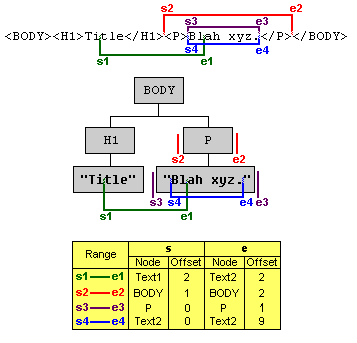

# 文档对象模型之Range

## 翻译
* 翻译者 fuyg
* 原文 [Document Object Model Range](http://www.w3.org/TR/2000/REC-DOM-Level-2-Traversal-Range-20001113/ranges.html)

## 撰写者
* Peter Sharpe, SoftQuad Software Inc.
* Vidur Apparao, Netscape Communications Corp.
* Lauren Wood, SoftQuad Software Inc.

## 内容列表
* 2.1. 简介
* 2.2. 定义和标记方法
    * 2.2.1. 位置
    * 2.2.2. 选取和部分选取
    * 2.2.3. 标记方法
* 2.3. 创建`Range`对象
* 2.4. 修改`Range`的位置
* 2.5. 比较`Range`的边界点(Boundary-Points)
* 2.6. 使用`Range`删除内容
* 2.7. 提取内容
* 2.8. 克隆内容
* 2.9. 插入内容
* 2.10. 环饰内容
* 2.11. 辅助方法
* 2.12. 文档发生改变时`Range`的更改
    * 2.12.1. 插入
    * 2.12.2. 删除
* 2.13. `Range`接口的正式描述
    * `Range`
    * DocumentRange
    * RangeException
    * RangeExceptionCode

## 2.1. 简介

一个`Range`对象用于描述`Document`, `DocumentFragment`或者Attr中
某一范围的内容. `Range`是连续的, 因此可以选择(selecting)边界点间的内容.

**注意:** 在文字编辑器或者字处理中, 用户可以创建一个选区(selection):

1. 在文档的某个位置点按下鼠标
2. 移动鼠标到其他位置点
3. 释放鼠标

由此产生的选区(selection)是连续的, 且由两个位置点的内容构成.

术语`选择(selecting)`并不是指每个`Range`与图形界面用户创建的选区(selection)
一一对应, 相反, 此类选区(selection)能够被作为`Range`给DOM用户使用.

**注意:** 在双向书写语言(如阿拉伯语, 希伯来文)中, 一个`Range`可能对于一个逻辑
选区(selection), 但该逻辑选区在显示上不必是连续的. 一个视觉上连续的选区
(selection), 在某些情况下, 也未必对应单单一个逻辑选区(selection), 因此, 可能由
一个以上的`Range`来表示.

`Range`接口提供了一些方法用于获取和操作文档树. 这些方法比Node接口提供的类似
方法更高级, 除了`Range`接口提供用于插入内容, 删除内容和复制内容的方法可以直
接映射至DOM Core的一系列Node操作. 从某种意义上说, `Range`的操作可以看做是实
现优化常见编辑形式的便捷方法.

该章节表述`Range`接口, 包含创建与移动`Range`的方法和操作`Range`内容
的方法.

以下的接口不是强制的. 一个DOM应用程序可能会使用`DOMImplementation`接口中
`hasFeature(feature, version)`方法, 分别使用参数值`Range`和`2.0`用于检查实现(译
注: 浏览器实现)是否支持该模块(译注: 即`Range`规范模块). 为了全面支持该模块, 实现
必须支持[文档对象模型二级核心(DOM Level 2 Core)规范](http://www.w3.org/TR/2000/REC-DOM-Level-2-Traversal-Range-20001113/references.html#DOMCore)`Core`特性.

## 2.2 定义和标记方法

### 2.2.1 位置
该章讲述文档的两种不同表现形式: 包含文档标签的文本源码表现形式和与文档对象模型
二级标准核心(DOM Level 2 Core)描述类似的树状表现形式.

一个`Range`对象由`Range`起始点和`Range`结尾点两个边界点构成. 在`Document`树或者
`DocumentFragment`树中, 一个边界点的位置以一个节点 (node)和一个偏移量(offset)为特
征.节点(node)被称为边界点和其位置的容器(container).  容器及其祖先节点是边界点和
其位置的祖先容器(ancestor container). 节点(node)内部的偏移量(offset)被称为边界
点及其位置的偏移量.如果容器(container)是Attr, `Document`, `DocumentFragment`,
Element或者EntityReference节点, 偏移量(offset)在其子节点中. 如果容器(container)
是CharacterData, Comment 或者 ProcessingInstruction节点, 偏移量(offset)在UTF-16
编码的字符串的16比特中.

`Range`的边界点必须有一个公共祖先容器--必须`Document`, DocumentFragement 和
Attr节点的其中一类. 也就是说, `Range`的内容必须全部在以单个`Document`,
`DocumentFragment` 或 Attr节点为根的子树中. 该公共祖先容器被称为`Range`的根容器
(root container). 根容器所在的树被称为`Range`的上下文树.

`Range`边界点的容器必须是一个Element, Comment, ProcessingInstruction,
EntifyReference, CDATASection, `Document`, `DocumentFragment`, Attr 或者 Text节点.
`Range`边界点的祖先容器不能是DocumentType, Entity, 或者 Notation 节点.

在文档的文本表现形式中, `Range`的边界点只能是标记的边界. 也就是说, 文本`Range`的边
界不能处于一个元素的开始和闭合标签的中间, 也不能在Entity或Character引用中. 一个
`Range`是位于有结构内容的连续一部分.

位置在文档文本表现形式和DOM节点树的关系使用下图表示:




在上图中, 例举了4个不同的`Range`. 每个`Range`的边界点分别标记`s#`(`Range`的起始)和
`e#`(`Range`的结尾), 其中`#`表示`Range`的顺序. 比如, 第2个`Range`, 起始位置在`BODY`元
素中`H1`元素之后, 结尾位置在`P`元素之前. 因此其位置在`BODY`中的`H1`与`P`之间.一
个容器非CharacterData节点的边界点, 如果其在第1个子节点之前, 其偏移量(offset)为
0; 如果其在第1个和第2个节点之间, 其偏移量(offset)为1; 以此类推. 故, 第2个`Range`
的起始点, 其容器为`BODY`, 偏移量为1. 容器为CharacterData的边界点的偏移量与此类
似, 只不过使用16比特的位置. 比如, 第1个`Range`标记为`s1`的边界点, 其容器是一个文
本节点(包含"Title"的节点), 其偏移量为2--因为其在第2个和第3个16比特之间.


请注意, 第3个`Range`和第4个`Range`在文本形式上是一致的位置. `Range`一个很重要的特性就
是`Range`的一个边界点可以明确地表示文档树的任何位置.

通过以下`Range`只读的属性, 可以获取其边界点的容器和偏移量:

```
readonly  attribute Node startContainer;
readonly  attribute long startOffset;
readonly  attribute Node endContainer;
readonly  attribute long endOffset;
```

如果一个`Range`的边界点拥有相同的容器和偏移量, 该`Range`可以称为折叠
(collapsed)`Range`. (在各个浏览器厂商中, 常被称为插入点(insertion point)).

### 2.2.2 选取和部分选取
一个节点或者16比特单位, 如果在一个`Range`的边界点之间, 常常说成被该`Range`选取了.
也就是说, 节点或16比特单位前的位置在`Range`结尾的前面, 节点或16比特单位后的位置在
`Range`开始之后(TODO: 有问题, 似乎???). 比如, 在文档的文本表现形式上, 一个元素, 如果其开始标签在`Range`的
开始位置之后, 且其闭合标签位于`Range`的结束位置之前, 该元素才能被称为被该`Range`选
取. 在上面的示例图表中, 第2个`Range`选取了`P`节点, 第3个`Range`选取了包含
"Blah xyz."的文本节点.

如果一个节点是某个`Range`的且仅仅是其**一个**边界点的祖先容器, 那么该节点可以称为
被该`Range`部分选取. 比如, 在上面的示例图表中, `H1`元素被第1个`Range`部分选取, 因为
该`Range`的起始位于`H1`的子节点中.

### 2.2.3 标记方法
该章的许多示例都是使用图表的方式呈现文档的文本表现形式. 在该章中, 使用加粗边界
点之间的字(包含标签和数据的字)来表示`Range`的边界点, 如:

`<FOO>`**`ABC<BAR>DEF`**`</BAR></FOO>`

如果两个边界点在相同的位置, 边界点可以使用加粗的脱字符(**^**)表示, 如:

`<FOO>A`**^**`BC<BAR>DEF</BAR></FOO>`

## 创建`Range`对象
可以使用DocumentRange接口提供的`createRange()`方法创建一个`Range`对象. 该接口可以
从实现`Document`接口的对象上获取.

```
    interface DocumentRange {
        Range createRange();
    }
```

使用该方法返回的`Range`对象的初始状态是: 其两个边界点位于其所在文档的开头, 在任何
内容之前. 换句话说, 每个边界点的容器是`Document`节点且在`Document`节点中的偏移量为0.
(TODO: 这可能是编辑器focus时位置不对的根本原因)

像`Document`接口里其他方法创建的对象(如Node和`DocumentFragment`对象)类型, 通过某一
特定文档实例创建的`Range`对象只能选取与该文档实例相关的`Document`, `DocumentFragment`
和Attr对象. 该类`Range`对象不能被其他文档实例使用.

## 2.4 修改`Range`对象的位置
一个`Range`对象的位置可以通过使用`setStart`和`setEnd`方法设置每个边界点的容器
(container)和偏移量(offset)来指定.

```
    void setStart(in Node parent, in long offset)
                        raises(RangeException);
    void setEnd(in Node parent, in long offset)
                        raises(RangeException);
```

如果一个`Range`对象的一个边界点


